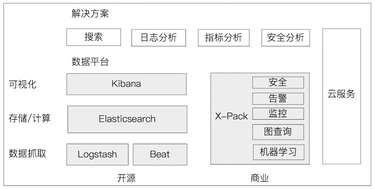

## ElasticStack家族成员及其应用场景

### 一.Elastic Stack生态圈

#### 1.Logstash：数据处理管道

* 开源的服务器端数据处理管道，支持从不同来源采集数据，转换数据，并将数据发送到不同的存储库中
* Logstash诞生于2009年，最初用来做日志的采集与处理
* Logstash创始人Jordan Sisel
* 2013年被ElasticSearch收购

#### 2.Logstash特性

* 实时解析和转换数据
  * 从IP地址破译除地理坐标
  * 将PII数据匿名化，完全排除敏感字段
* 可扩展
  * 200多个插件（日志、数据库、Arcsigh、Netflow）
* 可靠性安全性
  * Logstash会通过持久化队列来保证至少将运行中的事件送达一次
  * 数据传输加密
* 监控

#### 3.Kibana：可视化分析利器

* Kibana名字的含义 = Kiwifruit + Banana
* 数据可视化工具，帮助用户解开对数据的任何疑问
* 基于Logstash工具，2013年加入Elastic公司

#### 4.Elastic的发展

* 2015年3月收购Elastic Cloud，提供Cloud服务
* 2015年3月收购PacketBeat
* 2016年9月收购PreAlert - Machine Learning异常检测
* 2017年6月收购Opbeat进军APM
* 2017年11月收购Saas厂商Swiftype，提供网站和App搜索
* 2018年X-Pack开源

#### 5.BEATS

* 轻量的数据采集器

<<<<<<< HEAD
#### 6.X-Pack

* Elastic公司提供的商业化套件
* 6.3之前的版本，X-Pack以插件方式安装
* X-Pack开源之后，ElasticSearch & Kibana支持OSS版和Basic两个版本
  * 部分X-Pack功能支持免费试用，6.8和7.1开始Security功能免费
* OSS，Basic，黄金级，白金级
* https://www.elsatic.co/cn/subscriptions

#### 7.ELK（Elastic Stack）客户及应用场景

* 应用场景
  * 网站搜索、垂直搜索、代码搜索
  * 日志管理与分析、安全指标监控、应用性能监控、Web抓取舆情分析

#### 8.Elastic Search与数据库的集成

* 单独使用ElasticSearch作为存储（架构简单）
* 如果需要考虑事务性等内容时，建议将数据库写入或更新到数据库，建立同步机制更新ElasticSeach，到ElasticSearch中进行查询（将数据库与ElasticSearch进行同步）
* 以下情况可考虑与数据库集成
  * 与现有系统的集成
  * 需考虑事务性
  * 数据更新频繁
=======
> 未完待续...
>>>>>>> 233dac7cb57cb6dcb834f73f8c6fa7beaa1685ef
